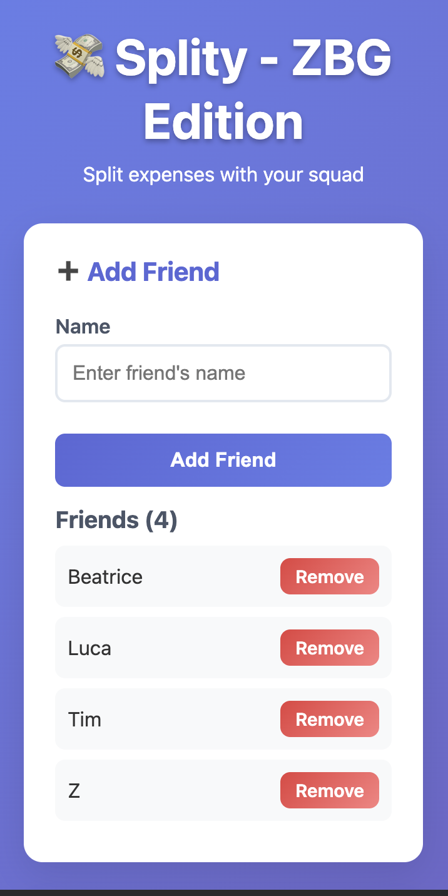
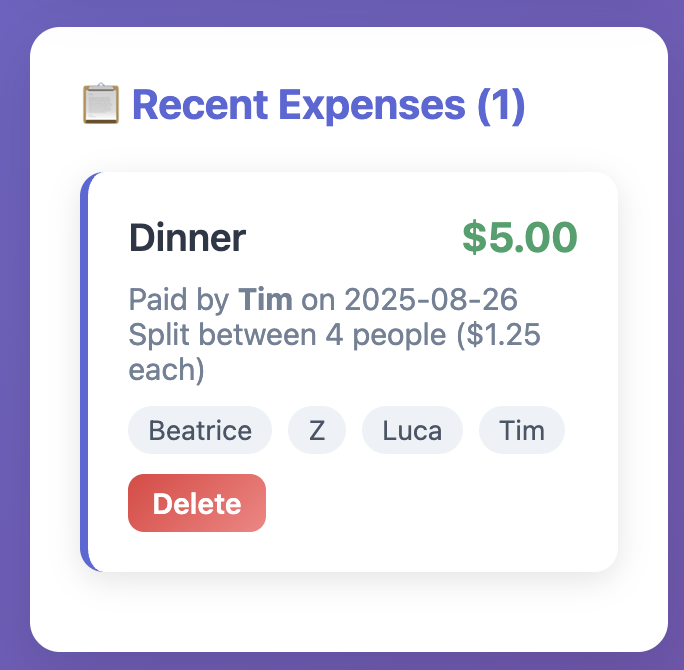
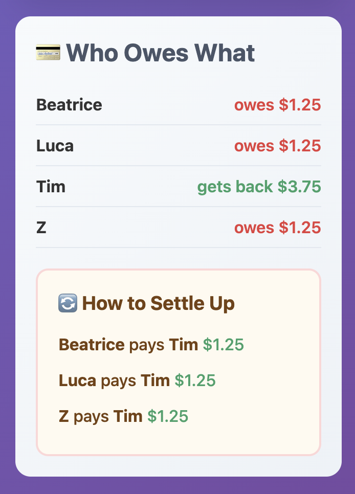

# 💸 Splity

Lightweight expense-splitting web app built with **Flask + PostgreSQL**.  
Auto-calculates balances and suggests minimal settlements to split bills with friends.

**Why I built this**: My friends and I were using Splitwise, but it limits free users to just a few expenses. 
So I created a free, self-hosted alternative that does everything we need without restrictions. 


### Designed primarily for mobile use - just share the link and everyone can add expenses on their phones.

[](https://your-demo-url.onrender.com)
[](https://python.org)
[](https://flask.palletsprojects.com/)




---

## 🛠️ Built With

**Backend:** Flask, SQLAlchemy, PostgreSQL  
**Frontend:** Jinja2, HTML/CSS, JavaScript  
**Features:** Real-time sync, balance algorithms, responsive UI  
**Deployed:** Gunicorn + Render

---

## ✨ What I Built

✅ **Database design** with many-to-many relationships (Person ↔ Expense)  
✅ **Balance calculation algorithms** - tracks who owes what to whom  
✅ **Greedy settlement algorithm** - minimizes transactions to settle all debts  
✅ **Real-time sync** across devices using polling API + version counter  
✅ **Full-stack web app** deployed to production with PostgreSQL

---

## 🚀 Key Features

- Add friends and shared expenses through clean UI
- Automatic balance calculation (who owes / who gets back)
- Smart settlement suggestions with minimal payments
- Real-time updates across all devices
- Responsive design for mobile and desktop

---

## 🔧 Quick Start

```bash
git clone https://github.com/your-username/splity.git
cd splity
pip install -r requirements.txt
flask run
```

Visit `http://127.0.0.1:5000` to see it in action!

---

**Live Demo:** [splity.onrender.com](https://splity.onrender.com)  
**GitHub:** [github.com/your-username/splity](https://github.com/your-username/splity)
